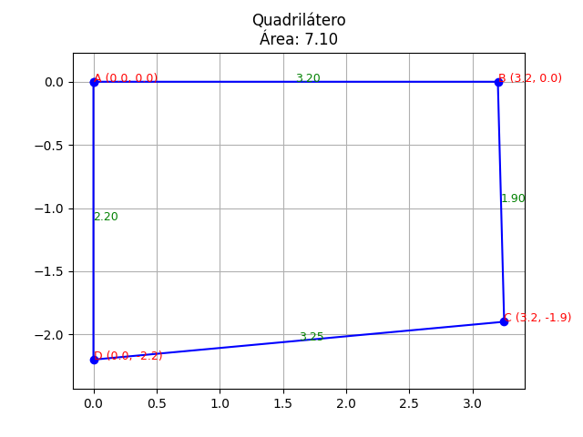

# Cálculo de Quadriláteros
Este projeto implementa um programa em Python que calcula a área de um quadrilátero a partir das distâncias das 4 laterais informadas pelo usuário. O programa também gera um gráfico que mostra o desenho do quadrilátero, com as coordenadas dos pontos e as medidas das laterais.

## Funcionalidades
- Recebe as distâncias das 4 laterais de um quadrilátero.
- Calcula a área aproximada do quadrilátero com base nas medidas fornecidas.
- Gera um gráfico mostrando o quadrilátero e as suas dimensões.
- Exibe as coordenadas de cada ponto e as distâncias das laterais no gráfico.

## Requisitos
- Python 3.x
- Bibliotecas Python:
  - matplotlib

# Como Instalar e Executar
## Passo 1: Clonar o Repositório
Clone este repositório para o seu computador usando o Git:

`
git clone https://github.com/seu-usuario/quadrilatero.git
`

## Passo 2: Criar um Ambiente Virtual
Se você ainda não tem um ambiente virtual configurado, você pode criar um usando o venv:

`
python -m venv venv
`

## Passo 3: Ativar o Ambiente Virtual
### No Windows:
`
.\venv\Scripts\activate
`
### No macOS/Linux:
`
source venv/bin/activate
`

## Passo 4: Instalar Dependências
Instale as dependências necessárias, como matplotlib, usando o pip:

`
pip install -r requirements.txt
`

Ou, se você não tem um arquivo requirements.txt, instale diretamente o matplotlib:

`
pip install matplotlib
`

## Passo 5: Executar o Programa
Após a instalação das dependências, execute o programa com:

`
python main.py
`

## Passo 6: Interação com o Programa
O programa irá pedir que você informe as distâncias das 4 laterais do quadrilátero (superior, direita, inferior e esquerda).
Ele calculará a área do quadrilátero e exibirá as coordenadas dos pontos, as medidas das laterais e a área aproximada no terminal.
O programa também irá gerar um gráfico com o desenho do quadrilátero, exibindo as medidas das laterais e as coordenadas de cada ponto.

# Exemplo de Uso
### Entrada:
```
Informe a distância da lateral A (superior): 3.2
Informe a distância da lateral B (direita): 1.9
Informe a distância da lateral C (inferior): 3.25
Informe a distância da lateral D (esquerda): 2.2
```

### Saída:

```
Medidas informadas:
Lateral 1: 3.20
Lateral 2: 1.90
Lateral 3: 3.25
Lateral 4: 2.20
Área aproximada: 7.10
```

O gráfico gerado exibirá o quadrilátero com as coordenadas dos pontos A, B, C e D, e as medidas das laterais.

<p align="center">
  
</p>

## Contribuindo
### Se você quiser contribuir para o projeto, siga estas etapas:

Faça um fork deste repositório.

Crie uma branch para suas modificações (`git checkout -b minha-modificacao`).

Faça suas alterações e commit (`git commit -am 'Adicionando uma nova funcionalidade'`).

Envie para o repositório remoto (`git push origin minha-modificacao`).

Crie um Pull Request.

## Licença
Este projeto está licenciado sob a licença MIT - veja o arquivo [LICENSE](https://github.com/nubrao/quadrilatero?tab=MIT-1-ov-file) para mais detalhes.

